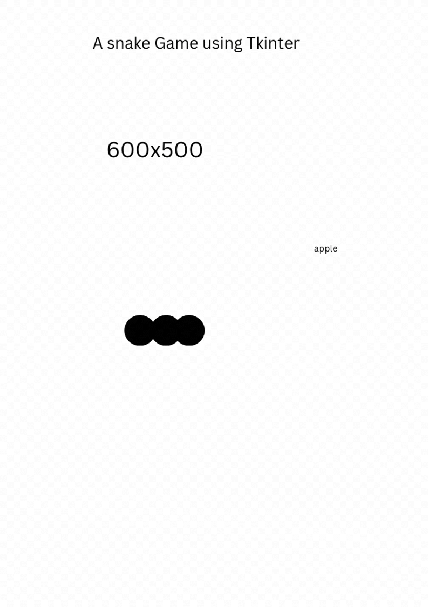

  

# Instructions to Create a Snake Game Using Tkinter  

1. **Set Up the Environment**:  
    - Import the `tkinter` library for GUI development.  
    - Create a new Tkinter window with a title and dimensions.  

2. **Create the Game Canvas**:  
    - Add a `Canvas` widget to the window to serve as the game area.  
    - Set the canvas dimensions and background color.  

3. **Draw the Snake**:  
    - Represent the snake as a series of rectangles.  
    - Use the `create_rectangle` method to draw the initial snake body.  

4. **Move the Snake**:  
    - Define a function to update the position of the snake.  
    - Use the `move` method to shift the rectangles in the desired direction.  

5. **Control the Snake**:  
    - Bind keyboard events (e.g., arrow keys) to control the snake's movement.  
    - Update the direction of movement based on the key pressed.  

6. **Add Food**:  
    - Randomly place a small rectangle or circle on the canvas as food.  
    - Check for collisions between the snake and the food.  

7. **Grow the Snake**:  
    - When the snake eats the food, add a new rectangle to its body.  
    - Update the snake's length dynamically.  

8. **Game Over Condition**:  
    - Detect collisions with the canvas boundaries or the snake's own body.  
    - Display a "Game Over" message and stop the game loop.  

9. **Game Loop**:  
    - Use the `after` method to create a continuous game loop.  
    - Update the snake's position and check for collisions in each iteration.  

10. **Run the Application**:  
     - Call the `mainloop` method to start the Tkinter application.  
